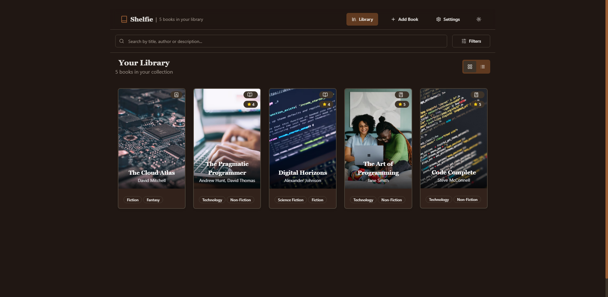

# 📚 Shelfie Collection

A modern, feature-rich book collection management application built with React, Firebase, and Framer Motion. Keep track of your books, manage your reading list, and organize your personal library with style.

## ✨ Features

- 📱 **Responsive Design**: Beautiful interface that works on desktop and mobile
- 🌓 **Dark/Light Mode**: Easy on the eyes, day or night
- 📚 **Book Management**:
  - Add, edit, and delete books
  - Upload book covers
  - Track reading status
  - Rate and review books
- 🔍 **Advanced Filtering**:
  - Search by title, author, or genre
  - Filter by reading status
  - Sort by various criteria
- ⚡ **Real-time Updates**: Changes sync instantly with Firebase
- 🎨 **Beautiful Animations**: Smooth transitions powered by Framer Motion
- 🏷️ **Genre Tagging**: Organize books by multiple genres
- 📊 **Reading Progress**: Track your reading journey

## 🛠️ Tech Stack

- [React](https://reactjs.org/) - UI Framework
- [TypeScript](https://www.typescriptlang.org/) - Type Safety
- [Vite](https://vitejs.dev/) - Build Tool
- [Firebase](https://firebase.google.com/) - Backend & Database
- [Tailwind CSS](https://tailwindcss.com/) - Styling
- [shadcn/ui](https://ui.shadcn.com/) - UI Components
- [Framer Motion](https://www.framer.com/motion/) - Animations

## 🚀 Getting Started

### Prerequisites

- Node.js (v16 or higher)
- npm or yarn
- Firebase account

### Installation

1. Clone the repository:
\`\`\`bash
git clone https://github.com/naveed-gung/shelfie-collection.git
cd shelfie-collection
\`\`\`

2. Install dependencies:
\`\`\`bash
npm install
\`\`\`

3. Create a .env file in the root directory:
\`\`\`env
VITE_FIREBASE_API_KEY=your_api_key
VITE_FIREBASE_AUTH_DOMAIN=your_auth_domain
VITE_FIREBASE_PROJECT_ID=your_project_id
VITE_FIREBASE_STORAGE_BUCKET=your_storage_bucket
VITE_FIREBASE_MESSAGING_SENDER_ID=your_messaging_sender_id
VITE_FIREBASE_APP_ID=your_app_id
VITE_FIREBASE_MEASUREMENT_ID=your_measurement_id
\`\`\`

4. Start the development server:
\`\`\`bash
npm run dev
\`\`\`

Visit \`http://localhost:5173\` to see the app running.

## 📦 Build

To build for production:

\`\`\`bash
npm run build
\`\`\`

## 🌐 Deployment

This project can be easily deployed to Netlify:

1. Push your code to GitHub
2. Connect your repository to Netlify
3. Configure build settings:
   - Build command: \`npm run build\`
   - Publish directory: \`dist\`
4. Add your environment variables in Netlify's dashboard

## 🤝 Contributing

Contributions are welcome! Please feel free to submit a Pull Request.

1. Fork the project
2. Create your feature branch (\`git checkout -b feature/AmazingFeature\`)
3. Commit your changes (\`git commit -m 'Add some AmazingFeature'\`)
4. Push to the branch (\`git push origin feature/AmazingFeature\`)
5. Open a Pull Request

## 📝 License

This project is licensed under the MIT License - see the [LICENSE](LICENSE) file for details.

## 🙏 Acknowledgments

- [shadcn/ui](https://ui.shadcn.com/) for the beautiful UI components
- [Lucide Icons](https://lucide.dev/) for the icons
- [Firebase](https://firebase.google.com/) for the backend services

---

Made with ❤️ by [Naveed](https://github.com/naveed-gung)
